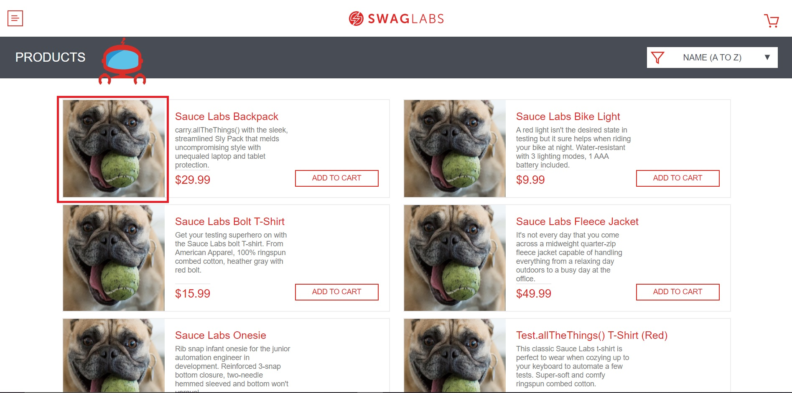

### Manual test Saucedemo.com functionality for username "problem_user"

|        Title        |  Operation system  | Environment |   Issue type    |  Severity  | Frequency  |   Source   |
|:-------------------:|:------------------:|:-----------:|:---------------:|:----------:|:----------:|:----------:|
| Wrong images on PLP | Windows 10 Pro | Chrome(x64) |   Functional    |    High    | Every time | Structured |

#### Action Performed
 1. Visit https://www.saucedemo.com/
 2. Login as username:problem_user, password: secret_sauce to see PLP

#### Expected result:
I expected to see the product image.

#### Actual result:
Image of happy dog displayed instead of product image

#### Image:

#### Chrome Logs:
>14:20:13.823 Navigated to https://www.saucedemo.com/
>14:20:14.516 DevTools failed to load source map: Could not load content for chrome-extension://gighmmpiobklfepjocnamgkkbiglidom/browser-polyfill.js.map: System error: net::ERR_FILE_NOT_FOUND
